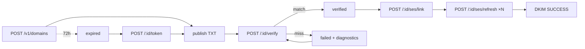

# API Conventions

Conventions only, endpoint-level detail lives in generated docs/SDK types, which are the source of truth.

## Versioning

Everything integrator-facing lives under `/v1`:

| Resource     | Routes                                                                             |
| ------------ | ---------------------------------------------------------------------------------- |
| Send         | `POST /v1/emails`, `POST /v1/emails/batch`, `GET /v1/emails`, `GET /v1/emails/:id` |
| Senders      | `GET                                                                               | POST /v1/senders`, `GET                                                                                                                                                       | PATCH                           | DELETE /v1/senders/:id`, `POST /v1/senders/:id/default`, `POST /v1/senders/:id/test` |
| Domains      | `GET                                                                               | POST /v1/domains`, `POST /v1/domains/:id/verify`, `POST /v1/domains/:id/token`, `POST /v1/domains/:id/ses/link`, `POST /v1/domains/:id/ses/refresh`, `DELETE /v1/domains/:id` |
| Templates    | `GET                                                                               | POST /v1/templates`, `GET                                                                                                                                                     | DELETE /v1/templates/:id`, `GET | POST /v1/templates/:id/versions`                                                     |
| Suppressions | `GET                                                                               | POST /v1/suppressions`, `DELETE /v1/suppressions/:id`                                                                                                                         |
| Webhooks     | `GET                                                                               | POST /v1/webhooks`, `DELETE /v1/webhooks/:id`, `POST /v1/webhooks/:id/rotate`, `GET /v1/webhooks/:id/deliveries`, `POST /v1/webhooks/:id/deliveries/:deliveryId/replay`       |
| Keys         | `GET                                                                               | POST /v1/keys`, `POST /v1/keys/:id/revoke`                                                                                                                                    |
| Projects     | `GET /v1/projects`                                                                 |
| Unsubscribe  | `GET                                                                               | POST /v1/unsubscribe` (token in the signed link; no API key)                                                                                                                  |

`/v1/openapi.json` is the machine-readable source of truth for shapes and
status codes; this page covers the conventions it cannot express. Internal
operator routes (`/v1/admin`, `/v1/cron`, `/v1/ses`, `/v1/beacon`,
`/v1/waitlist`, `/health`, `/ready`) are not part of the integration surface.

## Authentication

`Authorization: Bearer <api_key>`, prefixed by environment/type:

```
calder_pk_test_... calder_sk_test_...
calder_pk_live_... calder_sk_live_...
```

## Idempotency

`Idempotency-Key: <client-generated-key>` on mutating requests where duplication causes harm. Claims are atomic: the first request wins, and any other request with the same key replays the stored response (`200` with the original body), never double-executes, so a retried send can never produce duplicate mail. A key whose first request is still in flight returns `409` with `error.code: "idempotency_conflict"`, retry the same key after a moment. Keys expire 24h after first use.

## Send-time errors

Beyond validation (`400`), send endpoints can fail at ingest with:

- `422 { error: { code: "suppressed" } }`, the recipient is on the project's suppression list; the message gives the reason (`bounce`/`complaint`/`unsubscribe`/`manual`). Nothing is persisted or queued for a suppressed send.
- `409 { error: { code: "idempotency_conflict" } }`, see above.

## Error shape

```json
{
  "error": {
    "code": "domain_not_verified",
    "message": "The sending domain has not been verified.",
    "request_id": "req_..."
  }
}
```

Errors that carry machine-readable context add `details`; errors with a
known remedy add `fix` (plain language, safe to show a user):

```json
{
  "error": {
    "code": "plan_limit_reached",
    "message": "The Free plan allows 5,000 emails per billing period; 5,000 already used this period.",
    "request_id": "req_...",
    "details": {
      "limit": 5000,
      "usage": 5000,
      "tier": "free",
      "periodStart": "2026-09-01T00:00:00.000Z",
      "periodEnd": "2026-10-01T00:00:00.000Z"
    },
    "fix": "Upgrade at https://app.calder.click/usage or wait for the period reset."
  }
}
```

Validation failures (`400 validation_error`) put per-field issues in
`details` (`fieldErrors`/`formErrors`). Stack traces and provider secrets are
never returned.

## Rate limits

Per API key, project, and organization; different limits for sending vs. verification vs. dashboard endpoints. Responses include limit/remaining/reset.

## Sandbox / test mode

`test` keys never trigger real external delivery, simulated events and webhook deliveries only.

## Reputation streams

Every send records a `stream`: `transactional` (default) or `marketing`. Both
single sends (`POST /v1/emails`) and bulk sends (`POST /v1/emails/batch`)
default to `transactional`, so existing integrations never change lane;
marketing clients opt in explicitly via the request body. The streams are
recorded independently and can map to separate sender identities/configuration
sets so promotional traffic cannot contaminate transactional reputation.
Stream selection does not bypass consent, suppression, quota, or sender
verification — those gates run at ingest regardless of stream.

```json
{
  "from": "updates@example.com",
  "stream": "marketing",
  "to": "subscriber@example.com",
  "subject": "Product news",
  "text": "..."
}
```

## Sender rules (`from`)

The `from` address must resolve to an identity the project's active transport owns:

- **Verified domain** (SES/managed transports): any address on the domain.
- **Connected Gmail** (gmail transport): exactly the connected address, the
  transport pins the sender, spoofing is structurally impossible.

Unowned senders fail closed (`domain_not_verified` / `550`) with an explanation
pointing at verification or graduation, never silent, never delivered anyway.

## SES feedback ingress (`POST /v1/ses/events`)

Public endpoint for SES delivery feedback via SNS (no API key — SNS cannot
send our auth headers; ADR-035). Authenticity is the SNS RSA-SHA1 signature
against a certificate fetched only from allowlisted `sns.<region>.amazonaws.com`
origins, plus an optional topic allowlist (`SES_SNS_TOPIC_ARNS`, also required
to auto-confirm subscriptions). Accepts SNS envelopes (`text/plain` body):
delivery/open/click advance truth, permanent bounces and complaints update
the email and auto-insert a `suppressions` row, transient bounces only record
an event. Idempotent on the SNS MessageId — replays are acknowledged no-ops.
Unknown message ids are ledgered (`unmatched: true`) and acknowledged with 200.
Responses: `200 { ok: true, duplicate?, unmatched?, applied?, status? }`;
`400` on any authenticity/validation failure (SNS redelivers on 5xx, not 4xx,
so forged payloads are dropped permanently, not retried).

## SMTP (not REST, see docs/SMTP.md)

The SMTP gateway is a separate interface, not part of this REST surface. SMTP
credential management endpoints (create/rotate/revoke per project) will be
specified alongside gateway implementation, no paths are stable yet, so none
are listed here. Protocol behavior, normalization, and limits: `docs/SMTP.md`.

## Webhooks (`/v1/webhooks`)

Endpoints are signed, durable, retried, and replayable. Register one to
receive lifecycle events (`email.queued`, `email.sent`, `email.delivered`,
`email.bounced`, `email.complained`, `email.opened`, `email.clicked`).

### Create

`POST /v1/webhooks` — `{ url, events[] }`. `url` must be **public https**
(loopback/private/link-local/CGNAT ranges rejected with 400 + reason; the
same check runs again at delivery time in the worker). Response includes the
raw signing secret **once**:

```json
{ "id": "...", "secret": "whsec_..." }
```

The secret is stored AES-256-GCM-encrypted (never recoverable afterward) —
losing it means rotating.

### Receiving a delivery

One JSON POST per event, envelope identical to the stored delivery row:

```json
{
  "id": "<deliveryId>",
  "type": "email.delivered",
  "createdAt": "...",
  "data": { "emailId": "...", "...": "..." }
}
```

Headers:

```
webhook-id: <deliveryId>
webhook-signature: t=1758657600,v1=<hex hmac-sha256>
```

**Verify before trusting** (Node):

```js
const [t, v1] = h("webhook-signature")
  .split(",")
  .map((kv) => kv.slice(2));
const mac = crypto
  .createHmac("sha256", SECRET)
  .update(t + "." + rawBody, "utf8")
  .digest("hex");
if (Math.abs(Date.now() / 1000 - t) > 300) return res.status(401).end(); // replay window
if (!crypto.timingSafeEqual(Buffer.from(v1, "hex"), Buffer.from(mac, "hex")))
  return res.status(401).end();
```

Respond **2xx within 10s** — anything else counts as a failed attempt.

### Retry & dead-letter

Attempts: `5s → 30s → 2m → 10m → 30m → 2h → 6h`, then the delivery flips to
permanent `failed` (attempt 8/8). Nothing retries forever; the delivery row
records `attemptCount`, `latencyMs`, `responseStatus`, `lastError`, and when
the next retry fires (`nextAttemptAt`). Deleting or disabling the endpoint
mark-waits any in-flight delivery to terminal `failed` instead of burning
retries.

### Manage

- `GET /v1/webhooks` — list endpoints (secrets never leave the server).
- `DELETE /v1/webhooks/:id` — disable + detach; pending deliveries fail terminally.
- `POST /v1/webhooks/:id/rotate` — mint a new secret, shown once; future
  deliveries sign with it immediately. Old secret is dead for signing from
  now on (historical deliveries stay verifiable with whatever you had).
- `GET /v1/webhooks/:id/deliveries` — the last 25 deliveries (no payloads).
- `POST /v1/webhooks/:id/deliveries/:deliveryId/replay` — enqueue a **new**
  delivery carrying the original `data` to this endpoint only. Replays are
  never auto-deduped: dedupe on the business id inside `data` (e.g.
  `emailId`) if you must.

The dashboard's _Webhooks_ page shows the same log with per-delivery replay
and secret rotation.

## Domains (`/v1/domains`)

Ownership verification is a DNS-TXT challenge with a 72h TTL; deliverability
branding is a separate SES/DKIM step. Full Flow-D:



- `POST /v1/domains` `{domain}` → 201 with `{host: "_calder.<domain>",
value: "calder-verification=cvt_…", expiresAt}`. 409 if another
  organization already verified it. Re-POSTing your own domain is
  idempotent (returns the existing row).
- `POST /v1/domains/:id/verify` → one attempt. Responses: `verified`;
  `failed` with `{expected:{host,value}, found[]}` diagnostics (bounded);
  `failed` with `dns_error` (retryable); `410 expired` (mint a new token);
  `429` after 10 attempts/hour.
- `POST /v1/domains/:id/token` → fresh challenge (expired rows, or deliberate
  rotation). 409 if already verified.
- `POST /v1/domains/:id/ses/link` → after ownership: idempotent SES identity
  creation; returns 3 DKIM CNAMEs + SPF guidance; `502` on SES errors,
  `429` when SES throttles.
- `POST /v1/domains/:id/ses/refresh` → poll `VerifiedForSendingStatus`;
  wizard-driven while DKIM is `PENDING`.
- `DELETE /v1/domains/:id`.
- `GET /v1/domains` → secret-free projections (challenge visible only while
  pending/failed).
